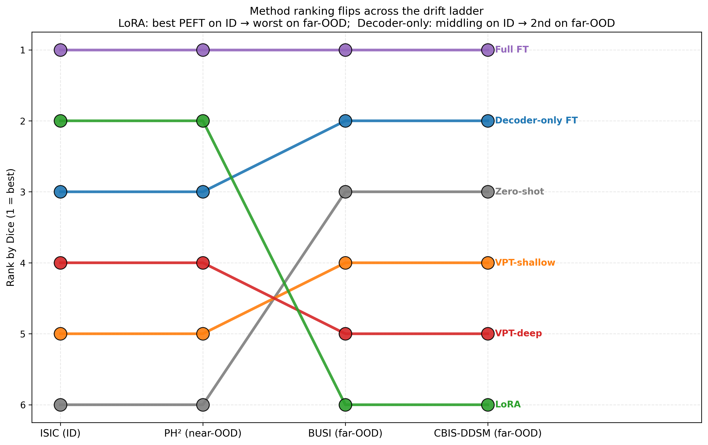

# MedSAM-VPT: Prompt Tuning vs Fine-Tuning for Medical Segmentation

**University project — Advanced Computer Vision and Pattern Recognition**

We compare six adaptation strategies for the **MedSAM** foundation model on
skin lesion segmentation, evaluating both in-distribution performance and
robustness under increasing distribution shift. The headline finding:
**parameter-efficient methods that aggressively modify the encoder (LoRA,
VPT) win in-distribution but lose dramatically under modality shift —
even falling below zero-shot performance.** Methods that leave the
encoder mostly intact (Decoder-only FT, Full FT with gentle LR) sacrifice
a fraction of a Dice point on ID to retain robustness across the drift ladder.

---

## Headline result



| Method | Trainable | ISIC (ID) Dice | PH² (near-OOD) Dice | BUSI (far-OOD) Dice |
|---|---:|---:|---:|---:|
| Zero-shot | 0 | 0.9072 | 0.9054 | 0.6830 |
| Decoder-only FT | 4.06 M | 0.9487 | 0.9466 | **0.7419** |
| VPT-shallow | 4.07 M | 0.9457 | 0.9436 | 0.6729 |
| VPT-deep | 4.15 M | 0.9472 | 0.9458 | 0.6632 |
| LoRA (r=8) | 4.35 M | 0.9545 | 0.9557 | 0.6449 |
| **Full FT** | 93.73 M | **0.9609** | **0.9583** | **0.7459** |

**On ISIC:** Full FT > LoRA > Decoder-only ≈ VPT-deep ≈ VPT-shallow > Zero-shot.
**On BUSI:** Full FT ≈ Decoder-only > Zero-shot > VPT-shallow > VPT-deep > LoRA.

LoRA goes from second-best on ID to **worst** on far-OOD (worse than
doing nothing). The full discussion is in `report/`; the explanation
boils down to *where* and *how aggressively* each method adapts the encoder.

See `results/figures/` for all eight plots and `results/summary_table.csv`
for the complete numeric table.

---

## Methods

All six methods share MedSAM ViT-B as the foundation model, the same
training data (ISIC 2018 Task 1, 2,594 dermoscopy images), the same loss
(½·BCE + ½·Dice), the same optimiser (AdamW with cosine LR), and the same
ground-truth-derived bounding-box prompts during forward passes. They
differ only in *which parameters are trainable*.

| Method | Trainable parameters | What's modified | Source |
|---|---|---|---|
| `zero_shot` | 0 | Nothing — pure inference | `configs/zero_shot.yaml` |
| `decoder_only` | 4,058,340 (4.33%) | Mask decoder only | `src/models/decoder_only.py` |
| `vpt_shallow` | 4,066,020 (4.34%) | 10 prompt tokens at encoder input + decoder | `src/models/vpt.py` |
| `vpt_deep` | 4,150,500 (4.43%) | 10 prompts at every transformer block + decoder | `src/models/vpt.py` |
| `lora` (r=8) | 4,353,252 (4.65%) | Low-rank residuals on encoder Q/V + decoder | `src/models/lora.py` |
| `full_ft` | 93,729,252 (99.99%) | Image encoder + mask decoder (LR=1e-5) | `src/models/full_ft.py` |

Implementation notes:

- **VPT** uses an additive-perturbation adaptation of Jia et al. (ECCV 2022)
  suitable for SAM's 2D-arranged ViT-B with window attention and relative
  positional embeddings. Token-prepending would require modifying SAM's
  attention pathway; additive perturbation matches the parameter count and
  per-layer modulation structure without architectural surgery.
- **LoRA** is implemented from scratch (no `peft` dependency) so the cluster
  environment doesn't have to drag in `transformers`/`tensorflow`. See
  `src/models/lora.py`.
- **Full FT** uses LR=1e-5 (50× lower than the PEFT methods) to keep
  encoder drift gentle.

---

## Datasets

| Dataset | Role | Size | Modality | Shift type |
|---|---|---|---|---|
| ISIC 2018 Task 1 | Train + ID test | 2,594 / 1,000 | Dermoscopy (RGB) | None |
| PH² | Near-OOD test | 200 | Dermoscopy (RGB) | Acquisition (different hospital, camera, cohort) |
| BUSI | Far-OOD test | 647 (487 benign + 210 malignant) | Breast ultrasound (greyscale) | Modality |

ISIC is downloaded from the ISIC Challenge archive. PH² is downloaded from
Kaggle (`athina123/ph2dataset`) — the original ADDI FTP is unreliable.
BUSI is from the Kaggle mirror (`aryashah2k/breast-ultrasound-images-dataset`)
of the Cairo University release (Al-Dhabyani et al. 2020).

---

## Reproducing the results

### 1. Environment

```bash
# Activate your Python environment (the project uses a venv called mlenv)
mlenv

# Install dependencies (segment_anything, monai for HD95, etc.)
pip install -r requirements.txt
```

### 2. Download MedSAM weights

```bash
python scripts/download_medsam.py
# Pulls medsam_vit_b.pth (~358 MB) from Zenodo
```

### 3. Place datasets

```
data/
├── train_images/, train_masks/    # ISIC 2018 train split
├── val_images/,   val_masks/      # ISIC 2018 validation split
├── test_images/,  test_masks/     # ISIC 2018 test split
├── ph2/
│   ├── trainx/                    # 200 dermoscopy images (.bmp)
│   └── trainy/                    # 200 lesion masks (.bmp)
└── busi/
    ├── benign/, malignant/, normal/   # Image + mask pairs (.png)
```

### 4. Train

Each method has its own config. Training writes `checkpoints/runs/<name>/best.pth`
and `train_log.csv`.

```bash
python -m src.train --config configs/decoder_only.yaml
python -m src.train --config configs/vpt_shallow.yaml
python -m src.train --config configs/vpt_deep.yaml
python -m src.train --config configs/lora.yaml
python -m src.train --config configs/full_ft.yaml      # needs ≥16 GB GPU
```

Resume support is built in:

```bash
python -m src.train --config configs/lora.yaml --resume
```

### 5. Evaluate

```bash
# Zero-shot (no checkpoint required)
python -m src.eval --config configs/zero_shot.yaml

# Trained checkpoints — appends a row to results/runs.csv per dataset
python -m src.eval --config configs/zero_shot.yaml \
    --checkpoint checkpoints/runs/lora_seed0/best.pth
```

Eval runs on every dataset listed in `configs/zero_shot.yaml`'s `test_sets:`
block. Toggle datasets there to skip BUSI, PH², or ISIC test.

### 6. Generate plots

```bash
python scripts/plots.py
# Produces 8 figures in results/figures/ + results/summary_table.csv
```

---

## Repository layout

```
medsam-vpt/
├── configs/                  # One YAML per training method
│   ├── decoder_only.yaml
│   ├── vpt_shallow.yaml
│   ├── vpt_deep.yaml
│   ├── lora.yaml
│   ├── full_ft.yaml
│   └── zero_shot.yaml        # Also used as the eval config
├── src/
│   ├── data/                 # ISIC, PH², BUSI dataset classes
│   ├── models/               # Method wrappers (one file per adaptation strategy)
│   ├── train.py              # Training entry point (resume-capable)
│   ├── eval.py               # Evaluation entry point
│   ├── losses.py             # DiceBCELoss
│   ├── metrics.py            # Dice, IoU, HD95
│   └── ...
├── scripts/
│   ├── download_medsam.py    # Pulls MedSAM weights from Zenodo
│   └── plots.py              # Builds all report figures
├── colab/
│   ├── train.ipynb           # Bootstrap notebook for Colab training
│   └── README.md             # Colab workflow notes
├── results/
│   ├── runs.csv              # Master results log (committed)
│   ├── summary_table.csv     # Pivoted summary table
│   ├── figures/              # 8 PNG figures for the report
│   └── raw/                  # Per-image CSVs (gitignored)
├── checkpoints/              # Trained model checkpoints (gitignored)
├── data/                     # Datasets (gitignored)
├── requirements.txt
└── README.md
```

---

## Figures

All eight figures are committed under `results/figures/`:

| File | What it shows |
|---|---|
| `1_dice_per_dataset.png` | Per-panel Dice bars with value labels for each dataset |
| `2_pareto_id_vs_ood.png` | Dice vs trainable parameters, separately for ID and far-OOD |
| `3_drift_gap.png` | ID−OOD Dice gap per method |
| `4_hd95_split.png` | Boundary error (HD95) for skin domain vs ultrasound, native scales |
| `5_id_vs_ood_scatter.png` | ID Dice vs OOD Dice with y=x diagonal showing drift cost |
| `6_drift_curves.png` | One line per method across the drift ladder |
| `7_rank_reversal.png` | Bumps chart: method ranks change as drift increases |
| `8_summary_heatmap.png` | Heatmap of Dice for methods × datasets |

---

## Hardware notes

Training was performed across three environments:

- **Local laptop** (RTX 1000 Blackwell, 8 GB VRAM) — Decoder-only FT.
  All evaluation runs (~8 min each).
- **Google Colab T4** (16 GB VRAM) — VPT-shallow training.
- **University JupyterLab A16** (16 GB virtual GPU) — VPT-deep, LoRA, Full FT.

The training loop supports gradient checkpointing (VPT) and gentle
learning rates (Full FT) to fit ViT-B encoder gradients into 16 GB. See
`configs/*.yaml` for memory-aware settings.

---

## License

Code: educational / research use. Datasets retain their original licenses:
- ISIC 2018 (CC-BY-NC)
- PH² (research-use, Univ. of Porto / ADDI)
- BUSI (CC0, Cairo University)

MedSAM weights from Ma et al. (2024), distributed via Zenodo.

---

## Acknowledgements

- **MedSAM** — Ma et al., 2024. https://github.com/bowang-lab/MedSAM
- **SAM** — Kirillov et al., Meta AI, 2023.
- **VPT** — Jia et al., ECCV 2022.
- **LoRA** — Hu et al., 2021.
- **ISIC** — Codella et al., 2018.
- **PH²** — Mendonça et al., 2013.
- **BUSI** — Al-Dhabyani et al., 2020.
