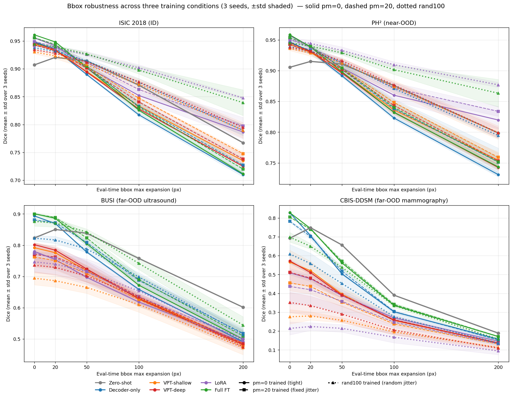
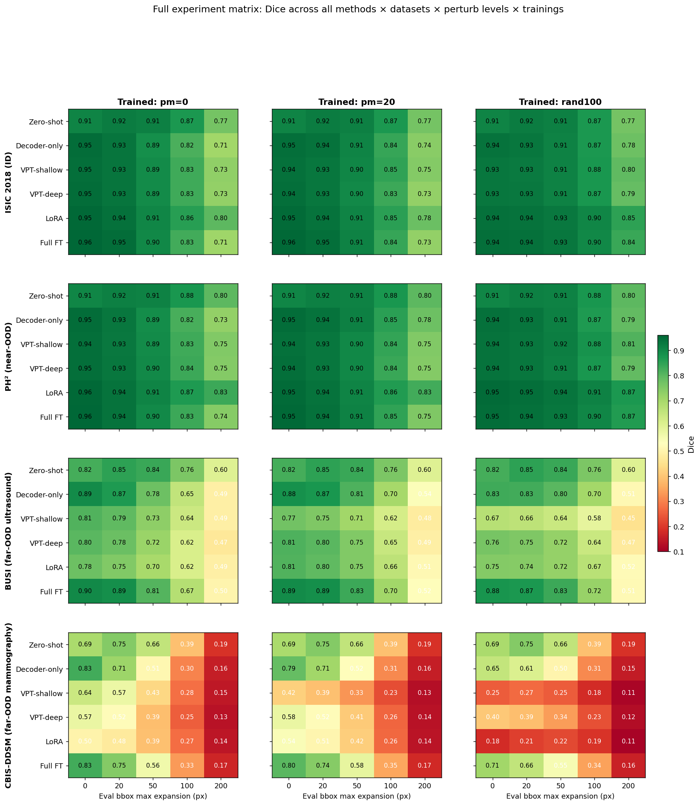
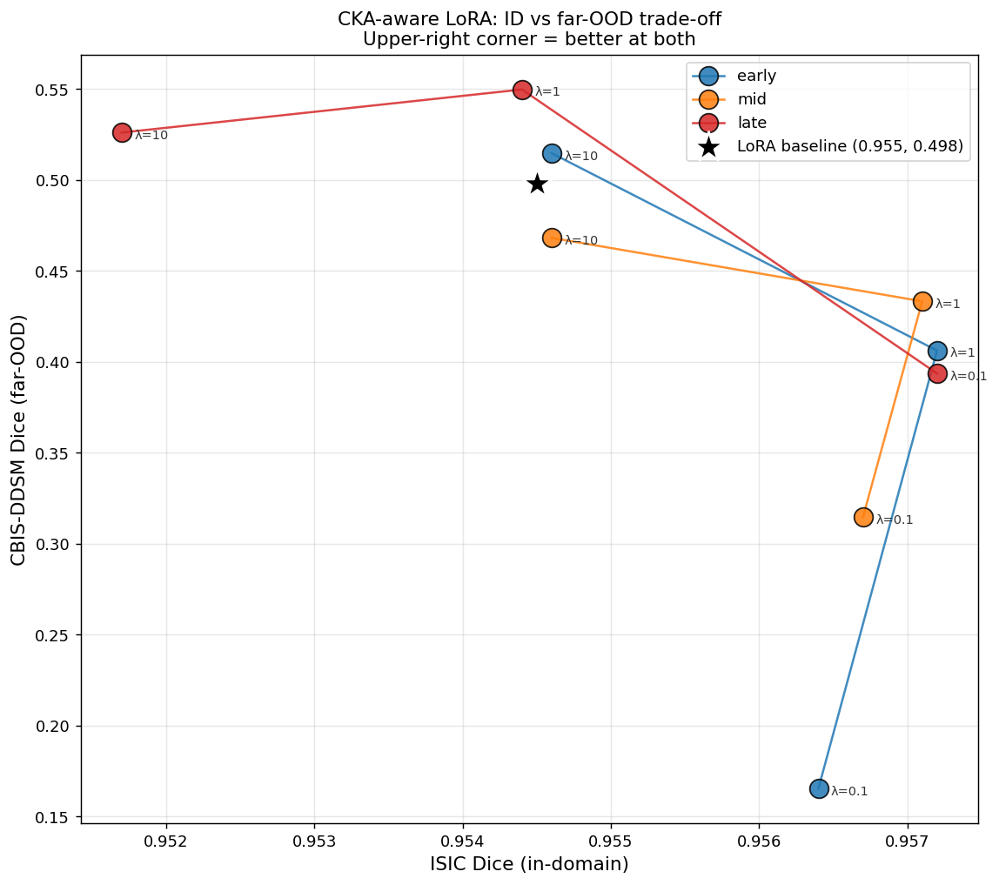

# When Adaptation Hurts: Representational Drift and OOD Failures in MedSAM Fine-Tuning

University research project (Advanced Computer Vision and Pattern Recognition),
prepared for MICCAI submission.

We compare zero-shot MedSAM with seven adaptation strategies under joint
domain shift and bounding-box prompt perturbation. Models are trained on
ISIC 2018 with clean, fixed 20 px, and random 0 to 100 px bbox jitter, then
evaluated under increasing prompt perturbation on in-domain ISIC 2018,
close-OOD PH2, and far-OOD BUSI and CBIS-DDSM. Adaptation improves in-domain
and close-OOD performance but often reduces far-OOD robustness. Full
fine-tuning gives the best tradeoff; encoder-only LoRA is the strongest
parameter-efficient alternative. Using centered kernel alignment (CKA), we
link far-OOD degradation to drift in the mask-decoder representations:
preserving decoder and output features is associated with robustness, while
encoder similarity alone is not.

---

## Headline result


Method rankings reverse across the domain-shift ladder (dermoscopy ISIC to
PH2 to ultrasound BUSI to mammography CBIS-DDSM). Methods that aggressively
modify the encoder (standard LoRA, VPT) win in-domain but fall below
zero-shot under the most extreme modality shift. Methods that leave the
decoder pathway intact (decoder-only, encoder-only LoRA, full FT) keep
far-OOD performance close to zero-shot.

---

## Setup

- Backbone: MedSAM ViT-B with a frozen prompt encoder, so bounding-box
  prompts are encoded identically across all experiments.
- Training data: ISIC 2018 Task 1, 2,594 dermoscopy images, 80/10/10
  train/val/test split, at 1024x1024.
- Optimisation: AdamW, mixed precision, 5 epochs, equally weighted
  Dice + cross-entropy loss. Full FT uses batch size 1 and LR 1e-5;
  parameter-efficient methods use batch size 4 and LR 1e-4.
- LoRA: rank r=8, scaling alpha=16, dropout 0.0. VPT: 10 prompt tokens per
  insertion point. Each configuration is repeated over 3 random seeds.

### Adaptation strategies

| Method | Trainable params | What is adapted | Source |
|---|---:|---|---|
| `zero_shot` | 0 | Nothing (pure inference) | `configs/zero_shot.yaml` |
| `decoder_only` | 4.06 M | Mask decoder only | `src/models/decoder_only.py` |
| `vpt_shallow` | 4.07 M | 10 prompt tokens at encoder input + decoder | `src/models/vpt.py` |
| `vpt_deep` | 4.15 M | 10 prompts at every encoder block + decoder | `src/models/vpt.py` |
| `lora` (r=8) | 4.35 M | Low-rank adapters on encoder QKV + decoder | `src/models/lora.py` |
| encoder-only LoRA | 4.13 M | Low-rank adapters on the image encoder only | (paper method, see note) |
| `full_ft` | 93.73 M | Image encoder + mask decoder (LR 1e-5) | `src/models/full_ft.py` |
| LoRA + CKA | 4.35 M | Standard LoRA + CKA-preservation auxiliary loss | `cka/`, `configs/lora_cka_*.yaml` |

Implementation notes:

- VPT uses an additive-perturbation adaptation of Jia et al. (ECCV 2022) for
  SAM's 2D-arranged ViT-B with window attention. Token-prepending would
  require modifying SAM's attention pathway; additive perturbation matches
  the parameter count and per-layer modulation without architectural surgery.
- LoRA is implemented from scratch (no `peft` dependency) and wraps the
  fused encoder QKV projection. See `src/models/lora.py`.
- Encoder-only LoRA restricts adapters to the image encoder (decoder left at
  base weights). It is evaluated in the paper; its training config is not yet
  on this branch (see the note at the bottom of this README).
- LoRA + CKA adds an auxiliary loss that penalises representational drift
  from frozen base MedSAM, computed via linear CKA on a fixed probe batch.
  See `cka/` and the CKA section below.

---

## Datasets

| Dataset | Role | Size | Modality | Shift |
|---|---|---|---|---|
| ISIC 2018 Task 1 | Train + ID test | 2,594 | Dermoscopy (RGB) | None |
| PH2 | Close-OOD test | 200 | Dermoscopy (RGB) | Acquisition (different source/cohort) |
| BUSI | Far-OOD test | 647 | Breast ultrasound (greyscale) | Modality |
| CBIS-DDSM | Far-OOD test | 362 | Mammography (X-ray) | Modality (most extreme) |

PH2 shares ISIC's modality and target but differs in acquisition source.
BUSI and CBIS-DDSM are different imaging modalities entirely. Loaders are in
`src/data/`. CBIS-DDSM filters to the official test split by PatientID and
OR-s multi-lesion masks.

---

## Bounding-box perturbation protocol

The same pixel-level jitter is a very different task across datasets: at
pm=200 the mean tight-box area grows 152% on ISIC but 1328% on CBIS-DDSM
(smaller lesions), so far-OOD evaluation under prompt noise is much harder
than in-domain.

- During training: clean boxes (pm=0), fixed 20 px jitter (pm=20), and
  random 0 to 100 px jitter (rand100).
- During evaluation: five perturbation levels, 0 / 20 / 50 / 100 / 200 px,
  expanding each box side outward so the lesion stays inside the prompt.

This gives a 7 methods x 4 datasets x 5 eval-jitter x 3 training-jitter
matrix, run over 3 seeds.

---

## Main results (perfect bounding box, pm=0)

Dice over 3 seeds at the exact tight ground-truth box. Best per dataset in bold.

| Method | Params | ISIC (ID) | PH2 (close-OOD) | BUSI (far-OOD US) | CBIS-DDSM (far-OOD X-ray) |
|---|---:|---:|---:|---:|---:|
| Zero-shot | 0.00 M | 0.907 | 0.905 | 0.823 | 0.692 |
| Decoder-only | 4.06 M | 0.949 | 0.947 | 0.894 | 0.828 |
| VPT-shallow | 4.07 M | 0.945 | 0.943 | 0.792 | 0.566 |
| VPT-deep | 4.15 M | 0.947 | 0.946 | 0.802 | 0.573 |
| LoRA | 4.35 M | 0.956 | 0.957 | 0.780 | 0.509 |
| LoRA + CKA (late) | 4.35 M | **0.966** | 0.959 | 0.813 | 0.536 |
| Encoder-only LoRA | 4.13 M | 0.957 | **0.961** | **0.906** | 0.805 |
| Full FT | 93.73 M | 0.961 | 0.958 | 0.901 | **0.829** |

On ID and close-OOD every method beats zero-shot and the rankings are
stable. On far-OOD the picture splits: VPT, standard LoRA, and LoRA+CKA drop
below zero-shot on at least one far-OOD set, while encoder-only LoRA, full
FT, and decoder-only stay above it. The full per-jitter and CKA breakdown is
in `summary_full_multiseed.csv` and `cka/results/`.

Mean Dice gain over zero-shot (paper Table 1), averaged across training
jitter and datasets within each regime:

| Method | ID | Close-OOD | Far-OOD | Overall |
|---|---:|---:|---:|---:|
| Decoder-only | -0.003 | -0.005 | -0.052 | -0.020 |
| VPT-shallow | 0.000 | -0.001 | -0.172 | -0.058 |
| VPT-deep | -0.001 | -0.002 | -0.154 | -0.052 |
| LoRA | **0.021** | **0.026** | -0.176 | -0.043 |
| Encoder-only LoRA | -0.001 | -0.005 | -0.043 | -0.016 |
| Full FT | 0.007 | 0.008 | **-0.018** | **-0.001** |

Standard LoRA gives the largest ID and close-OOD gains but the worst far-OOD
drop. Full FT is the strongest overall, encoder-only LoRA the strongest
parameter-efficient method.

---

## Robustness under prompt perturbation



Dice degrades as evaluation jitter grows, but not uniformly. Full fine-tuning
and the encoder-preserving methods have the shallowest curves; standard LoRA
and VPT drop fastest. On BUSI at high jitter zero-shot overtakes all adapted
models, and on CBIS-DDSM every method collapses below 0.2 Dice at pm=200.
(Curves shown for the methods implemented on this branch; solid = pm=0
training, dashed = pm=20, dotted = rand100, bands = +/- std over 3 seeds.)



Training jitter is a clean tradeoff, not a free win. Random 0 to 100 px
jitter (rand100) gives the best prompt robustness on the training modality
and the best overall adapted models, but it costs far-OOD modality transfer:
under rand100, standard LoRA on CBIS-DDSM falls from 0.509 to 0.214 at the
tight box. Full fine-tuning and encoder-only LoRA benefit most from variable
jitter while keeping the smallest far-OOD penalty.

---

## CKA analysis: which representations matter

Each adaptation shifts internal MedSAM representations. We measure linear CKA
between each adapted checkpoint and zero-shot MedSAM, layer by layer, and
correlate it with Dice gain over zero-shot.

Spearman / Pearson correlation between CKA and far-OOD Dice gain (paper
Table 2, n=300, FDR-corrected):

| CKA feature | ID | Close-OOD | Far-OOD |
|---|---:|---:|---:|
| IoU token layer | 0.10 / 0.11 | -0.02 / -0.02 | **0.76 / 0.69** |
| Output layer | 0.06 / 0.03 | 0.00 / -0.02 | **0.76 / 0.72** |
| Decoder layers | -0.08 / -0.11 | -0.02 / -0.08 | **0.73 / 0.69** |
| Upscaled embedding | 0.20 / 0.05 | 0.29 / 0.21 | **0.71 / 0.79** |
| Encoder layers | -0.28 / -0.30 | -0.28 / -0.35 | 0.09 / 0.06 |

Far-OOD degradation is strongly associated with drift in decoder and output
representations, while encoder CKA does not explain robustness. This is why
encoder-only LoRA is more robust than standard LoRA: it adapts the image
encoder while leaving the decoder pathway close to base MedSAM.

### CKA-aware auxiliary loss

We also test CKA as a training-time regulariser. The objective adds a
decoder-preservation term to the task loss:

```
L_total = L_task + lambda * sum_l w_l * (1 - CKA(X_l, Y_l))
```

where X_l, Y_l are activations of frozen base MedSAM and the fine-tuned model
on a fixed probe batch. Base activations are cached once; the task and CKA
terms are backpropagated separately before a single optimizer step to save
memory. Math and hooks are in `src/cka.py` and `cka/`.



LoRA + CKA (late-decoder hooks) improves in-domain Dice and lifts CBIS-DDSM
above the standard-LoRA baseline at the tight box, but its far-OOD advantage
does not survive heavier prompt jitter, so the paper reports it but does not
recommend it over encoder-only LoRA. Full sweep results are in `cka/results/`
and `cka/figures/`.

---

## Conclusions

- Zero-shot MedSAM is hard to beat once far-OOD robustness under prompt noise
  is considered.
- Full fine-tuning is the best overall tradeoff; encoder-only LoRA is the
  best parameter-efficient alternative, clearly ahead of standard LoRA and VPT
  under OOD shift.
- CKA ties these outcomes to internal representation change: preserving
  decoder and output features is associated with far-OOD robustness; encoder
  similarity is not.
- Variable 0 to 100 px jitter training yields the most reliable adapted
  models on the training modality, at the cost of far-OOD transfer.

---

## Reproducing

### 1. Environment

```bash
pip install -r requirements.txt
python scripts/download_medsam.py   # MedSAM ViT-B weights (~358 MB) from Zenodo
```

### 2. Datasets

Place ISIC 2018, PH2, BUSI, and CBIS-DDSM under `data/` (gitignored). Loader
paths are documented in `src/data/`.

### 3. Train and evaluate

```bash
# Train one method (clean boxes)
python -m src.train --config configs/lora.yaml          # --resume supported
python -m src.train --config configs/full_ft.yaml       # needs >=16 GB GPU

# Jitter-trained variants
python -m src.train --config configs/lora_pm20.yaml
python -m src.train --config configs/lora_rand100.yaml

# Evaluate (appends a row per dataset to results/runs.csv)
python -m src.eval --config configs/zero_shot.yaml
```

### 4. Multi-seed pipeline and figures

```bash
python scripts/generate_seed_configs.py     # seed-1 / seed-2 configs
bash scripts/run_seed_pipeline.sh           # train + eval + aggregate (long; use tmux)
python scripts/seed_significance.py          # paired tests on the headline claims
python scripts/plots.py                      # results/figures/*.png
python bbox_robustness/compare_trainings.py  # bbox_robustness/comparison/*.png
```

### 5. CKA experiments

```bash
python cka/generate_cka_configs.py
bash cka/run_cka_sweep.sh                       # CKA-aware LoRA sweep
python cka/analysis/aggregate_cka_sweep.py      # cka/figures/*.png, cka/results/*.csv
```

---

## Repository layout

```
medsam-vpt/
  configs/        One YAML per training method, jitter setting, and seed
  src/
    data/         ISIC, PH2, BUSI, CBIS-DDSM dataset classes
    models/       One file per adaptation strategy
    cka.py        Linear CKA (differentiable, training-time)
    train.py      Training entry point (resume-capable, CKA-aware)
    eval.py       Evaluation entry point
    losses.py     Dice + BCE loss
    metrics.py    Dice, IoU, HD95
  cka/            CKA hooks, probe, config generator, sweep, analysis
  scripts/        Weights download, seed pipeline, significance tests, plots
  bbox_robustness/ Prompt-perturbation eval and comparison figures
  results/        Summary CSVs and report figures (results/figures/)
  requirements.txt
```

Large intermediate artifacts (per-image CSVs, qualitative grid dumps,
checkpoints, datasets) are kept locally and gitignored.

---

## Figures

| Path | Shows |
|---|---|
| `results/figures/1_dice_per_dataset.png` | Per-dataset Dice bars |
| `results/figures/2_pareto_id_vs_ood.png` | Dice vs trainable parameters, ID and far-OOD |
| `results/figures/3_drift_gap.png` | ID minus OOD Dice gap per method |
| `results/figures/5_id_vs_ood_scatter.png` | ID vs OOD Dice with y=x drift-cost diagonal |
| `results/figures/6_drift_curves.png` | One line per method across the drift ladder |
| `results/figures/7_rank_reversal.png` | Method ranks reversing as drift increases |
| `results/figures/8_summary_heatmap.png` | Dice heatmap, methods x datasets |
| `results/figures/qualitative/` | Prediction overlays per method x dataset |
| `bbox_robustness/comparison/comparison_curves_3way.png` | Dice vs eval jitter, all methods and trainings |
| `bbox_robustness/comparison/multi_heatmap_3way.png` | Full Dice matrix across the experiment |
| `cka/figures/` | CKA-aware LoRA sweep (tradeoffs, heatmaps, probe comparison) |

---

## Acknowledgements

- MedSAM: Ma et al., 2024. https://github.com/bowang-lab/MedSAM
- SAM: Kirillov et al., Meta AI, 2023.
- VPT: Jia et al., ECCV 2022.
- LoRA: Hu et al., 2021.
- CKA: Kornblith et al., ICML 2019.
- Datasets: ISIC (Codella et al., 2018), PH2 (Mendonca et al., 2013),
  BUSI (Al-Dhabyani et al., 2020), CBIS-DDSM (Lee et al., 2017).

Datasets retain their original licenses (ISIC CC-BY-NC, PH2 research-use,
BUSI CC0, CBIS-DDSM TCIA). MedSAM weights from Ma et al. (2024) via Zenodo.
