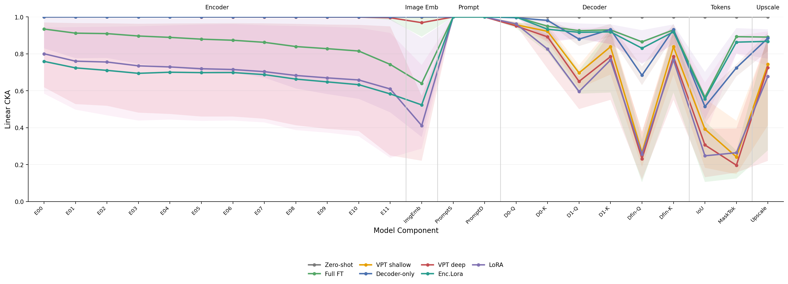
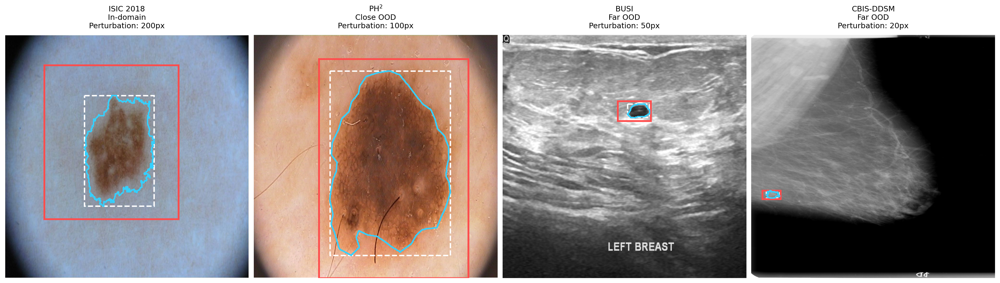
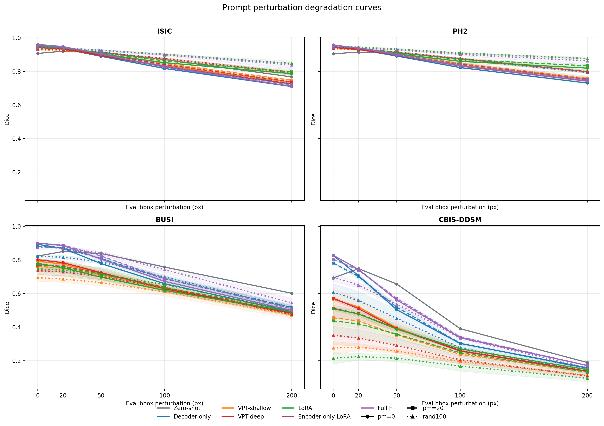
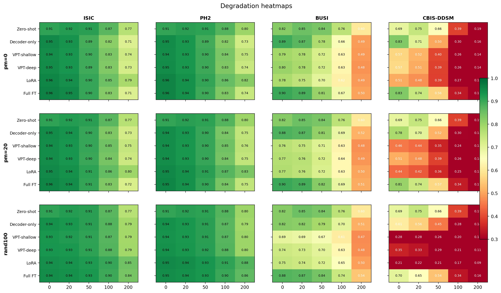
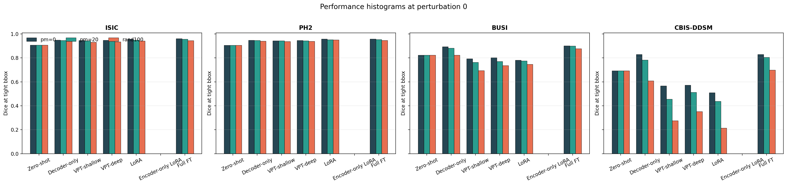

<div align="center">
<h1>When Adaptation Hurts: Connecting Representational Drift to OOD Failures in MedSAM Fine-Tuning</h1>

**Marko Haralović**<sup>1,2*</sup> · **Sounic Akkaraju**<sup>1*</sup> · **Carlo Baretta**<sup>1</sup> · **Vasil Zapryanov**<sup>1</sup> · **Alexia Briassouli**<sup>1</sup>

<sup>1</sup>University of Twente, Enschede, The Netherlands&emsp;&emsp;<sup>2</sup>University of Zagreb, Zagreb, Croatia<br>
<sup>*Equal contribution</sup>
</div>


## Setup

```bash
conda create -n medsam-vpt python=3.11 -y
conda activate medsam-vpt
pip install torch torchvision --index-url https://download.pytorch.org/whl/cu121
pip install -r requirements.txt
python scripts/download_medsam.py
```

The datasets should be placed under `data/`:

- `data/isic2018`
- `data/ph2`
- `data/busi`
- `data/cbis-ddsm`

This trimmed repo keeps the main training, evaluation, plotting pipeline, and
the encoder-only LoRA variant used in the final comparison tables.

## Training

### Clean boxes (`pm=0`)

```bash
python -m src.train --config configs/decoder_only.yaml
python -m src.train --config configs/vpt_shallow.yaml
python -m src.train --config configs/vpt_deep.yaml
python -m src.train --config configs/lora.yaml
python -m src.train --config configs/lora_encoder_only.yaml
python -m src.train --config configs/full_ft.yaml
```

### Fixed jitter training (`pm=20`)

```bash
python -m src.train --config configs/decoder_only_pm20.yaml
python -m src.train --config configs/vpt_shallow_pm20.yaml
python -m src.train --config configs/vpt_deep_pm20.yaml
python -m src.train --config configs/lora_pm20.yaml
python -m src.train --config configs/lora_encoder_only_pm20.yaml
python -m src.train --config configs/full_ft_pm20.yaml
```

### Random jitter training (`rand100`)

```bash
python -m src.train --config configs/decoder_only_rand100.yaml
python -m src.train --config configs/vpt_shallow_rand100.yaml
python -m src.train --config configs/vpt_deep_rand100.yaml
python -m src.train --config configs/lora_rand100.yaml
python -m src.train --config configs/lora_encoder_only_rand100.yaml
python -m src.train --config configs/full_ft_rand100.yaml
```

## Evaluation

Zero-shot evaluation:

```bash
python -m src.eval --config configs/zero_shot.yaml
```

Example checkpoint evaluation:

```bash
python -m src.eval --config configs/lora.yaml --checkpoint checkpoints/runs/lora_seed0/best.pth
```

To aggregate the three seeds:

```bash
python scripts/aggregate_seeds.py
```

## Main Result

Tight-box Dice (`perturb_max_px = 0`) on in-domain (ISIC) close-OOD (PH2)  and far-OOD (BUSI, CBIS-DDSM).

| Method | ISIC | PH2 | BUSI | CBIS-DDSM |
|---|---:|---:|---:|---:|
| Zero-shot | 0.907 | 0.905 | 0.823 | 0.692 |
| Decoder-only | 0.949 | 0.947 | 0.894 | 0.828 |
| VPT-shallow | 0.945 | 0.943 | 0.792 | 0.566 |
| VPT-deep | 0.947 | 0.946 | 0.802 | 0.572 |
| LoRA | 0.956 | 0.957 | 0.780 | 0.509 |
| Encoder-only LoRA | 0.957 | 0.961 | 0.906 | 0.805 |
| Full FT | 0.961 | 0.958 | 0.901 | 0.828 |


## Figures

Overview across all jitters and datasets.



Prompt perturbation example:



Performance degradation curves across increasing bbox jitter in evaluation across models.



Performance degradation heatmaps across increasing bbox jitter in evaluation across models.



Performance histograms.




## Checkpoints Used

The main paper figures in this trimmed repo use the following seed-0
checkpoints.

| Method | Training regime | Config | Checkpoint |
|---|---|---|---|
| Zero-shot | `pm=0` | [`configs/zero_shot.yaml`](configs/zero_shot.yaml) | Base MedSAM only |
| Decoder-only | `pm=0` | [`configs/decoder_only.yaml`](configs/decoder_only.yaml) | `checkpoints/runs/decoder_only_seed0/best.pth` |
| VPT-shallow | `pm=0` | [`configs/vpt_shallow.yaml`](configs/vpt_shallow.yaml) | `checkpoints/runs/vpt_shallow_seed0/best.pth` |
| VPT-deep | `pm=0` | [`configs/vpt_deep.yaml`](configs/vpt_deep.yaml) | `checkpoints/runs/vpt_deep_seed0/best.pth` |
| LoRA | `pm=0` | [`configs/lora.yaml`](configs/lora.yaml) | `checkpoints/runs/lora_seed0/best.pth` |
| Encoder-only LoRA | `pm=0` | [`configs/lora_encoder_only.yaml`](configs/lora_encoder_only.yaml) | `checkpoints/runs_perfect_bboxes/lora_encoder_only_r28_all_seed0/best.pth` |
| Full FT | `pm=0` | [`configs/full_ft.yaml`](configs/full_ft.yaml) | `checkpoints/runs/full_ft_seed0/best.pth` |
| Decoder-only | `pm=20` | [`configs/decoder_only_pm20.yaml`](configs/decoder_only_pm20.yaml) | `checkpoints/runs_pm20/decoder_only_seed0_pm20/best.pth` |
| VPT-shallow | `pm=20` | [`configs/vpt_shallow_pm20.yaml`](configs/vpt_shallow_pm20.yaml) | `checkpoints/runs_pm20/vpt_shallow_seed0_pm20/best.pth` |
| VPT-deep | `pm=20` | [`configs/vpt_deep_pm20.yaml`](configs/vpt_deep_pm20.yaml) | `checkpoints/runs_pm20/vpt_deep_seed0_pm20/best.pth` |
| LoRA | `pm=20` | [`configs/lora_pm20.yaml`](configs/lora_pm20.yaml) | `checkpoints/runs_pm20/lora_seed0_pm20/best.pth` |
| Encoder-only LoRA | `pm=20` | [`configs/lora_encoder_only_pm20.yaml`](configs/lora_encoder_only_pm20.yaml) | `checkpoints/runs_pm20/lora_encoder_only_r28_all_seed0_pm20/best.pth` |
| Full FT | `pm=20` | [`configs/full_ft_pm20.yaml`](configs/full_ft_pm20.yaml) | `checkpoints/runs_pm20/full_ft_seed0_pm20/best.pth` |
| Decoder-only | `rand100` | [`configs/decoder_only_rand100.yaml`](configs/decoder_only_rand100.yaml) | `checkpoints/runs_rand100/decoder_only_seed0_rand100/best.pth` |
| VPT-shallow | `rand100` | [`configs/vpt_shallow_rand100.yaml`](configs/vpt_shallow_rand100.yaml) | `checkpoints/runs_rand100/vpt_shallow_seed0_rand100/best.pth` |
| VPT-deep | `rand100` | [`configs/vpt_deep_rand100.yaml`](configs/vpt_deep_rand100.yaml) | `checkpoints/runs_rand100/vpt_deep_seed0_rand100/best.pth` |
| LoRA | `rand100` | [`configs/lora_rand100.yaml`](configs/lora_rand100.yaml) | `checkpoints/runs_rand100/lora_seed0_rand100/best.pth` |
| Encoder-only LoRA | `rand100` | [`configs/lora_encoder_only_rand100.yaml`](configs/lora_encoder_only_rand100.yaml) | `checkpoints/runs_rand100/lora_encoder_only_r28_all_seed0_rand100/best.pth` |
| Full FT | `rand100` | [`configs/full_ft_rand100.yaml`](configs/full_ft_rand100.yaml) | `checkpoints/runs_rand100/full_ft_seed0_rand100/best.pth` |