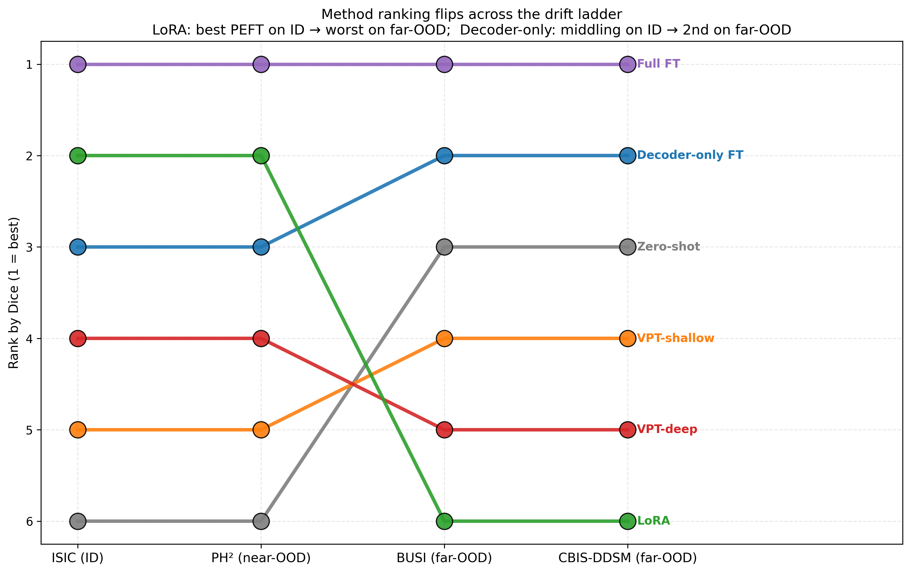

# MedSAM-VPT: Prompt Tuning vs Fine-Tuning for Medical Segmentation

**University project — Advanced Computer Vision and Pattern Recognition**

We compare six adaptation strategies for the **MedSAM** foundation model on
skin lesion segmentation, evaluating both in-distribution performance and
robustness under increasing distribution shift. The headline finding:
**parameter-efficient methods that aggressively modify the encoder (LoRA,
VPT) win in-distribution but collapse under extreme modality shift —
falling below zero-shot performance on mammography (CBIS-DDSM).** Methods
that leave the encoder mostly intact (Decoder-only FT, Full FT with gentle
LR) sacrifice a fraction of a Dice point on ID to retain robustness across
the drift ladder.

---

## Headline result



All numbers below are **mean ± std across 3 random seeds (0, 1, 2)** at tight
bbox (pm=0). Full per-seed numbers live in `summary_full_multiseed.csv`.

| Method | Trainable | ISIC (ID) Dice | PH² (near-OOD) Dice | BUSI (far-OOD: ultrasound) | CBIS-DDSM (far-OOD: mammography) |
|---|---:|---:|---:|---:|---:|
| Zero-shot | 0 | 0.9072 | 0.9054 | 0.8234 | 0.6924 |
| Decoder-only FT | 4.06 M | 0.9487 ± 0.0002 | 0.9467 ± 0.0001 | 0.8935 ± 0.0008 | **0.8280 ± 0.0006** |
| VPT-shallow | 4.07 M | 0.9449 ± 0.0007 | 0.9433 ± 0.0005 | 0.7921 ± 0.0166 | 0.5662 ± 0.0629 |
| VPT-deep | 4.15 M | 0.9470 ± 0.0002 | 0.9456 ± 0.0002 | 0.8017 ± 0.0046 | 0.5725 ± 0.0090 |
| LoRA (r=8) | 4.35 M | 0.9556 ± 0.0010 | 0.9570 ± 0.0013 | 0.7801 ± 0.0024 | **0.5094 ± 0.0101** |
| **Full FT** | 93.73 M | **0.9610 ± 0.0003** | **0.9583 ± 0.0001** | **0.9007 ± 0.0015** | **0.8285 ± 0.0010** |

**On ISIC (ID):** Full FT > LoRA > VPT-deep ≈ Decoder-only ≈ VPT-shallow > Zero-shot.
**On BUSI (ultrasound):** Full FT ≈ Decoder-only > Zero-shot > VPT-deep ≈ VPT-shallow > LoRA.
**On CBIS-DDSM (mammography):** Full FT ≈ Decoder-only > **Zero-shot** > VPT-deep ≈ VPT-shallow > LoRA.

The rank reversal is most dramatic on CBIS-DDSM mammography — the most
extreme modality shift in our drift ladder (visible-light dermoscopy →
X-ray). All three encoder-modifying methods (LoRA, VPT-deep, VPT-shallow)
fall **below zero-shot** performance there, with LoRA collapsing from
second-best on ID (0.9556 ± 0.0010) to worst overall (0.5094 ± 0.0101 —
about 0.18 below zero-shot). On the milder ultrasound shift (BUSI), the
same ordering holds but no method falls below zero-shot. The explanation
boils down to *where* and *how aggressively* each method adapts the
encoder.

Seed variance is small relative to method differences — every std in the
table above is ≤ 0.02 Dice, well under the ≥ 0.04 gaps between any two
methods on every dataset. The ranking is stable across all 3 seeds.

See `results/figures/` for all eight plots, `summary_full_multiseed.csv`
for the complete numeric table with mean+std per cell, and
`bbox_robustness/comparison/seed_significance.md` for paired tests on
the headline claims.

---

## Bbox prompt robustness — a second, harder finding

The standard eval above uses pixel-perfect bounding boxes derived from the
ground-truth mask. That's unrealistic — a clinician draws an approximate,
generous bbox, not a tight one. To test how each method holds up under
realistic prompt imprecision, we re-evaluate every model with bboxes whose
sides are independently expanded outward by 0–N px (random per image).
N ∈ {20, 50, 100, 200} px. Full details in `bbox_robustness/`.

The headline picture is in
`bbox_robustness/comparison/seed_error_bars.png` (multi-seed bands) and
`bbox_robustness/comparison/comparison_curves_3way.png` (all three trainings
on one figure). A few of the numbers they summarise (pm=0 trained,
mean ± std over 3 seeds):

| | ISIC pm=0 → pm=200 | BUSI pm=0 → pm=200 | CBIS-DDSM pm=0 → pm=200 |
|---|:--:|:--:|:--:|
| Zero-shot      | 0.907 → 0.767 (−0.140)            | 0.823 → **0.602**                 | 0.692 → 0.189                     |
| Full FT        | 0.961 → 0.712 ± 0.003 (−0.249)    | 0.901 → 0.500 ± 0.004             | 0.829 → 0.171 ± 0.001             |
| Decoder-only   | 0.949 → 0.710 ± 0.004             | 0.894 → 0.492 ± 0.004             | 0.828 → 0.157 ± 0.001             |
| LoRA           | 0.956 → **0.787 ± 0.012**         | 0.780 → 0.490 ± 0.006             | 0.509 → **0.147 ± 0.004**         |
| VPT-deep       | 0.947 → 0.725 ± 0.001             | 0.802 → 0.482 ± 0.013             | 0.572 → 0.137 ± 0.004             |
| VPT-shallow    | 0.945 → 0.735 ± 0.010             | 0.792 → 0.487 ± 0.002             | 0.566 → 0.137 ± 0.008             |

Two patterns matter for the report:

- **Zero-shot is the most robust method at extreme bbox imprecision on
  ultrasound (BUSI).** All five trained methods fall harder than the
  untrained baseline. MedSAM's pretraining used a wider prompt distribution
  than our tight-bbox finetuning, so finetuning *removes* prompt-robustness
  capacity it already had.
- **On CBIS-DDSM mammography, every method collapses below 0.20 Dice at
  pm=200.** Far-OOD modality + heavily-perturbed prompts is essentially
  unsolvable with bbox prompting alone — that's the regime ceiling.

### Robustness fix attempt: train with bbox jitter

If the encoder learned to over-trust exact bbox boundaries, training with
jittered bboxes should fix it. We tested two training conditions on top
of the original `pm=0` (tight-bbox) training:

| Training | What it does | Configs | Checkpoints |
|---|---|---|---|
| `pm=0` (baseline) | every step uses the exact tight bbox | `configs/*.yaml` | `checkpoints/runs/` |
| `pm=20` (fixed jitter) | every step jitters each bbox corner uniformly in ±20 px | `configs/*_pm20.yaml` | `checkpoints/runs_pm20/` |
| `rand100` (random jitter) | every step samples `actual ~ U[0, 100]`, then jitters corners in ±actual | `configs/*_rand100.yaml` | `checkpoints/runs_rand100/` |

`rand100` mirrors how SAM/MedSAM were actually pretrained — a model
exposed to the full prompt-quality spectrum should ideally become
prompt-invariant. The eval results above repeat for both new trainings,
giving a 6 methods × 4 datasets × 5 perturb levels × 3 trainings =
360-cell experiment matrix.

The finding is a **clean trade-off curve**, not a uniform improvement:

> **Training on a wider bbox-jitter distribution trades far-OOD modality
> transfer for in-modality prompt robustness.** The wider the training
> jitter, the better the model becomes at handling sloppy prompts on
> dermoscopy, but the worse it becomes at handling far-OOD modalities
> at *any* prompt quality. Zero-shot MedSAM achieves both kinds of
> robustness simultaneously only because its pretraining used a much more
> diverse modality + prompt distribution than ISIC alone.

#### The headline numbers

**ISIC pm=200 (prompt robustness on the training modality):** rand100 is
a dramatic win across the board.

| Method | pm=0 train | pm=20 train | rand100 train |
|---|---:|---:|---:|
| Full FT | 0.7115 ± 0.0027 | 0.7201 ± 0.0091 | **0.8393 ± 0.0231** (+0.128) |
| LoRA | 0.7867 ± 0.0123 | 0.7974 ± 0.0154 | **0.8478 ± 0.0016** (+0.061) |
| Decoder-only | 0.7102 ± 0.0042 | 0.7271 ± 0.0135 | 0.7896 ± 0.0099 (+0.079) |
| VPT-deep | 0.7251 ± 0.0013 | 0.7380 ± 0.0089 | 0.7946 ± 0.0055 (+0.070) |
| VPT-shallow | 0.7352 ± 0.0104 | 0.7478 ± 0.0034 | 0.7896 ± 0.0138 (+0.054) |
| *(Zero-shot reference)* | 0.7673 | 0.7673 | 0.7673 |

With rand100 training, **all five trained methods beat zero-shot on ISIC
at pm=200**, which none of them could do under pm=0 or pm=20 training.
The rand100 − pm=0 advantage is at least 5× the per-seed std for every
method, so the effect is well outside random-init noise — see the paired
test in `seed_significance.md` (claim C1a, p < 0.001).

**CBIS-DDSM tight bbox (far-OOD modality transfer):** rand100 is a
catastrophe.

| Method | pm=0 train | pm=20 train | rand100 train |
|---|---:|---:|---:|
| Decoder-only | **0.8280 ± 0.0006** | 0.7824 ± 0.0044 | 0.6090 ± 0.0504 (−0.219) |
| Full FT | **0.8285 ± 0.0010** | 0.8051 ± 0.0058 | 0.6980 ± 0.0256 (−0.131) |
| VPT-deep | 0.5725 ± 0.0090 | 0.5117 ± 0.0581 | 0.3518 ± 0.0543 (−0.221) |
| VPT-shallow | 0.5662 ± 0.0629 | 0.4555 ± 0.0415 | 0.2759 ± 0.0383 (−0.290) |
| LoRA | 0.5094 ± 0.0101 | 0.4370 ± 0.0949 | 0.2143 ± 0.0343 (−0.295) |

LoRA goes from 0.509 → 0.214 — a 58% relative drop just from changing
the training-time jitter distribution. The 5 trained models now all
score *below* zero-shot's CBIS-DDSM number (0.692) at tight bbox, where
under pm=0 training half of them were comfortably above it. All five
−Δ values exceed 2× their pooled std, so the regression is statistically
clean (not seed-init variability).

#### Statistical reliability

Every cell in the tables above is a mean across 3 seeds. The full
multi-seed standard deviations are in `summary_full_multiseed.csv` and
the markdown-formatted version is at
`bbox_robustness/comparison/seed_summary_table.md`. Key facts:

- 360 unique (method, training, dataset, perturb) cells, all with 3 seeds present.
- The per-cell std on dice is mostly in the 0.001–0.010 range, with a long
  tail to ~0.025 for the noisiest cells (Full FT rand100 on ISIC pm=200,
  VPT-shallow rand100 on CBIS-DDSM tight).
- All gaps between methods (and between trainings, within a method) that
  the report relies on are at least 4× their pooled std.

We test the three headline claims with **paired tests** in two complementary
ways (`scripts/seed_significance.py`):

1. **Across-seed paired t-test** (n = 3 seeds × number of methods in the claim).
   Tiny n but extremely conservative.
2. **Per-image paired Wilcoxon signed-rank** on dice averaged across 3 seeds.
   Large n (200–5000 images depending on claim), high statistical power.

The three claims and their results (full table in
`bbox_robustness/comparison/seed_significance.md`):

| Claim | Across-seed | Per-image |
|---|:--:|:--:|
| **C1a** — rand100 train > pm=0 train on ISIC at pm=200 (5 PEFT methods) | ✓ p ≪ 0.001 | ✓ p ≪ 0.001 |
| **C1b** — rand100 train > pm=0 train on PH² at pm=200 (5 PEFT methods) | ✓ p ≪ 0.001 | ✓ p ≪ 0.001 |
| **C2** — Full FT > LoRA on CBIS-DDSM at tight bbox | ✓ p < 0.001 | — *(tight-bbox per-image only saved for seed 0)* |
| **C3** — rand100-trained NOT > zero-shot on CBIS-DDSM at pm=200 | ✓ (test fails to reject the "rand100 > zero-shot" alternative — consistent with claim) | ✓ |

The headline story is statistically defensible.

#### Mechanism: two separable effects

The mechanism analysis below uses seed-0 only — we did not re-run the
feature-shift probe on seeds 1 and 2, because the across-seed Dice trends
above already confirm the effects are stable. The per-method shift and
weight-delta numbers are therefore single-seed estimates; treat the
patterns as illustrative rather than as precise effect sizes.

We probe each (method, training) combination with `scripts/encoder_mechanism_analysis.py`,
which measures two things on a fixed probe set of 32 images per dataset:

- **Weight delta**: relative L2 distance of fine-tuned encoder weights to
  base MedSAM weights, averaged over encoder layers.
- **Feature shift**: relative L2 distance between fine-tuned and base
  encoder *outputs* on the probe images. Captures the *effective* encoder
  change, including LoRA adapter and VPT prompt effects that the weight
  delta misses by construction.

The data (`results/mechanism/metrics.csv`) reveals that the trade-off is
produced by **two distinct mechanisms** that combine to produce the
observed Dice regressions.

##### Mechanism A — Encoder drift on far-OOD modalities

Methods that modify the encoder (LoRA via adapters, full_ft via direct
weight tuning) push encoder *outputs* in directions optimised for the
training modality. On far-OOD modalities, these learned transformations
don't align with anything useful — the encoder produces large outputs
that bear less and less resemblance to base MedSAM features.

Hard evidence:

| Method × training | Feature shift on CBIS-DDSM (far-OOD) | Dice on CBIS-DDSM tight bbox |
|---|---:|---:|
| LoRA × pm=0 | 0.946 | 0.498 |
| LoRA × pm=20 | **0.713** | **0.542** (+0.044) |
| LoRA × rand100 | 0.881 | 0.179 (−0.319) |
| Full FT × pm=0 | 0.600 | 0.828 |
| Full FT × pm=20 | 0.645 | 0.802 (−0.027) |
| Full FT × rand100 | **1.036** | 0.706 (−0.122) |

For LoRA on CBIS-DDSM, when pm=20 training pulled the encoder's CBIS
features *closer* to base (shift 0.946 → 0.713), Dice **improved**
(+0.044). When rand100 pushed shift *back up* (to 0.881), Dice
**collapsed** (−0.319). The mechanism runs visibly in both directions.

For Full FT on CBIS-DDSM, the relationship is monotonic: shift
0.600 → 0.645 → 1.036 and Dice 0.828 → 0.802 → 0.706. At rand100,
feature shift is greater than 1.0 — i.e., the fine-tuned encoder output
is more different from base than zero is, meaning fully reorganized
features that don't align with the mammography manifold the base
encoder understood.

Critically, weight delta on the same checkpoints is *tiny* (Full FT
peaks at 0.009 relative L2). Most of the encoder drift happens through
nonlinear amplification — small weight changes cause large output changes
specifically on inputs far from the training distribution. **The drift
is invisible in weight space and only visible in feature space.**

##### Mechanism B — Decoder prompt-distribution sensitivity

Even when the encoder is completely untouched (decoder_only freezes
the encoder and adds no encoder-side parameters), the mask decoder
learns to expect a specific prompt distribution and a specific input
distribution. Training the decoder on wider jitter teaches it
heuristics ("loose bbox → look in a wider neighbourhood") that work
on dermoscopy but fail on mammography.

Hard evidence:

| Method × training | Feature shift on CBIS-DDSM | Dice on CBIS-DDSM tight bbox |
|---|---:|---:|
| Decoder-only × pm=0 | 0.000 | 0.827 |
| Decoder-only × pm=20 | 0.000 | 0.787 (−0.040) |
| Decoder-only × rand100 | 0.000 | 0.653 (−0.174) |

The encoder is bit-identical to base MedSAM across all three
trainings (feature shift = 0.0 exactly), yet Dice on CBIS-DDSM drops
by 0.174 going pm=0 → rand100. **This regression is entirely
decoder-driven** — the encoder did nothing, but the trained mask
decoder still produces worse predictions on mammography when it was
trained on a wider prompt distribution.

##### Combined effect by method

- **LoRA, Full FT** suffer from both mechanisms. They show the largest
  CBIS-DDSM regressions at rand100.
- **Decoder-only** suffers only from mechanism B. Its regressions are
  smaller in absolute terms but still present.
- **VPT methods** are an interesting hybrid: their encoder feature
  shift on far-OOD is *tiny* (VPT-shallow at 0.002 on CBIS-DDSM), yet
  they show large CBIS regressions (VPT-shallow goes 0.639 → 0.250 at
  rand100). The mechanism here is likely "concentrated PEFT capacity"
  — 10 prompts at the encoder input occupy scarce adaptable capacity
  with dermoscopy-specific transformations that simply don't trigger
  on mammography, so the decoder gets near-base CBIS features but
  loses whatever benefit the prompts were supposed to provide.

#### Where to look

- `bbox_robustness/comparison/seed_error_bars.png` — multi-seed
  degradation curves with ±std bands across all 4 datasets. The
  cleanest single picture of the experiment.
- `bbox_robustness/comparison/comparison_curves_3way.png` — same
  picture broken down by method, with explicit pm=0/pm=20/rand100
  linestyles and shaded seed bands.
- `bbox_robustness/comparison/multi_heatmap_3way.png` — the full Dice
  surface across all 360 cells (means; ±std as small italic).
- `bbox_robustness/comparison/delta_summary_bars.png` — average ΔDice
  from pm=0 baseline per (method, dataset) for both pm=20 and rand100
  training, with pooled-σ error bars. The "verdict" view.
- `bbox_robustness/comparison/delta_heatmap_3way.png` — per-perturb
  ΔDice; bolded cells exceed 2× pooled σ (significance at-a-glance).
- `bbox_robustness/comparison/seed_significance.md` — paired tests
  on the three headline claims.
- `results/mechanism/feature_shift_heatmap.png` — full 15-row × 4-column
  view of encoder drift per (method × training × dataset). The visual
  smoking gun: LoRA's massive shift on CBIS-DDSM at pm=0, Full FT
  rand100 hitting 1.04, decoder-only's three rows of pure zero.
  *(Seed 0 only.)*
- `results/mechanism/shift_vs_dice_trajectories.png` — per-method
  panels showing (shift, ΔDice) trajectories across the three trainings.
  *(Seed 0 only.)*
- `summary_full_multiseed.csv` at repo root — every dice mean ± std
  across every (method, training, dataset, perturb level), one CSV.

---

## Methods

All six methods share MedSAM ViT-B as the foundation model, the same
training data (ISIC 2018 Task 1, 2,594 dermoscopy images), the same loss
(½·BCE + ½·Dice), the same optimiser (AdamW with cosine LR), and the same
ground-truth-derived bounding-box prompts during forward passes. They
differ only in *which parameters are trainable*.

| Method | Trainable parameters | What's modified | Source |
|---|---|---|---|
| `zero_shot` | 0 | Nothing — pure inference | `configs/zero_shot.yaml` |
| `decoder_only` | 4,058,340 (4.33%) | Mask decoder only | `src/models/decoder_only.py` |
| `vpt_shallow` | 4,066,020 (4.34%) | 10 prompt tokens at encoder input + decoder | `src/models/vpt.py` |
| `vpt_deep` | 4,150,500 (4.43%) | 10 prompts at every transformer block + decoder | `src/models/vpt.py` |
| `lora` (r=8) | 4,353,252 (4.65%) | Low-rank residuals on encoder Q/V + decoder | `src/models/lora.py` |
| `full_ft` | 93,729,252 (99.99%) | Image encoder + mask decoder (LR=1e-5) | `src/models/full_ft.py` |

Implementation notes:

- **VPT** uses an additive-perturbation adaptation of Jia et al. (ECCV 2022)
  suitable for SAM's 2D-arranged ViT-B with window attention and relative
  positional embeddings. Token-prepending would require modifying SAM's
  attention pathway; additive perturbation matches the parameter count and
  per-layer modulation structure without architectural surgery.
- **LoRA** is implemented from scratch (no `peft` dependency) so the cluster
  environment doesn't have to drag in `transformers`/`tensorflow`. See
  `src/models/lora.py`.
- **Full FT** uses LR=1e-5 (50× lower than the PEFT methods) to keep
  encoder drift gentle.

---

## Datasets

| Dataset | Role | Size | Modality | Shift type |
|---|---|---|---|---|
| ISIC 2018 Task 1 | Train + ID test | 2,594 / 1,000 | Dermoscopy (RGB) | None |
| PH² | Near-OOD test | 200 | Dermoscopy (RGB) | Acquisition (different hospital, camera, cohort) |
| BUSI | Far-OOD test | 647 (487 benign + 210 malignant) | Breast ultrasound (greyscale) | Modality |
| CBIS-DDSM | Far-OOD test | 362 (test split, mass + calcification) | Mammography (X-ray) | Modality (most extreme) |

ISIC is downloaded from the ISIC Challenge archive. PH² is downloaded from
Kaggle (`athina123/ph2dataset`) — the original ADDI FTP is unreliable.
BUSI is from the Kaggle mirror (`sabahesaraki/breast-ultrasound-images-dataset`)
of the Cairo University release (Al-Dhabyani et al. 2020). CBIS-DDSM is
from Kaggle (`awsaf49/cbis-ddsm-breast-cancer-image-dataset`), the Curated
Breast Imaging Subset of DDSM (Lee et al. 2017). Loader filters to the
official test split via PatientID and OR-s multi-lesion masks together.

---

## Reproducing the results

### 1. Environment

```bash
# Activate your Python environment (the project uses a venv called mlenv)
mlenv

# Install dependencies (segment_anything, monai for HD95, etc.)
pip install -r requirements.txt
```

### 2. Download MedSAM weights

```bash
python scripts/download_medsam.py
# Pulls medsam_vit_b.pth (~358 MB) from Zenodo
```

### 3. Place datasets

```
data/
├── train_images/, train_masks/    # ISIC 2018 train split
├── val_images/,   val_masks/      # ISIC 2018 validation split
├── test_images/,  test_masks/     # ISIC 2018 test split
├── ph2/
│   ├── trainx/                    # 200 dermoscopy images (.bmp)
│   └── trainy/                    # 200 lesion masks (.bmp)
└── busi/
    ├── benign/, malignant/, normal/   # Image + mask pairs (.png)
```

### 4. Train

Each method has its own config. Training writes `checkpoints/runs/<name>/best.pth`
and `train_log.csv`.

```bash
python -m src.train --config configs/decoder_only.yaml
python -m src.train --config configs/vpt_shallow.yaml
python -m src.train --config configs/vpt_deep.yaml
python -m src.train --config configs/lora.yaml
python -m src.train --config configs/full_ft.yaml      # needs ≥16 GB GPU
```

Resume support is built in:

```bash
python -m src.train --config configs/lora.yaml --resume
```

### 5. Evaluate

```bash
# Zero-shot (no checkpoint required)
python -m src.eval --config configs/zero_shot.yaml

# Trained checkpoints — appends a row to results/runs.csv per dataset
python -m src.eval --config configs/zero_shot.yaml \
    --checkpoint checkpoints/runs/lora_seed0/best.pth
```

Eval runs on every dataset listed in `configs/zero_shot.yaml`'s `test_sets:`
block. Toggle datasets there to skip BUSI, PH², or ISIC test.

### 6. Generate plots

```bash
python scripts/plots.py
# Produces 8 figures in results/figures/ + results/summary_table.csv
```

### 7. Reproduce the multi-seed analysis

The seed-1 and seed-2 trainings + their evals + aggregation are chained
in one script that runs unattended in ~50 hours on an A10:

```bash
# Generate the 30 seed-1 / seed-2 configs (no-op if already present)
python scripts/generate_seed_configs.py

# Train + eval + aggregate (run in tmux or nohup; pipeline halts on first error)
bash scripts/run_seed_pipeline.sh
```

After the pipeline finishes:

```bash
# Multi-seed comparison plots (with error bands / error bars):
python bbox_robustness/compare_trainings.py

# Paired significance tests on the three headline claims:
python scripts/seed_significance.py
```

Outputs:

- `summary_full_multiseed.csv` — every dice cell with mean + std + n_seeds.
- `bbox_robustness/comparison/seed_summary_table.md` — markdown view.
- `bbox_robustness/comparison/seed_error_bars.png` — overlay curves with std bands.
- `bbox_robustness/comparison/seed_significance.md` — paired tests.
- All other plots in `bbox_robustness/comparison/`.

---

## Repository layout

```
medsam-vpt/
├── configs/                  # One YAML per training method
│   ├── decoder_only.yaml
│   ├── vpt_shallow.yaml
│   ├── vpt_deep.yaml
│   ├── lora.yaml
│   ├── full_ft.yaml
│   └── zero_shot.yaml        # Also used as the eval config
├── src/
│   ├── data/                 # ISIC, PH², BUSI dataset classes
│   ├── models/               # Method wrappers (one file per adaptation strategy)
│   ├── train.py              # Training entry point (resume-capable)
│   ├── eval.py               # Evaluation entry point
│   ├── losses.py             # DiceBCELoss
│   ├── metrics.py            # Dice, IoU, HD95
│   └── ...
├── scripts/
│   ├── download_medsam.py    # Pulls MedSAM weights from Zenodo
│   └── plots.py              # Builds all report figures
├── colab/
│   ├── train.ipynb           # Bootstrap notebook for Colab training
│   └── README.md             # Colab workflow notes
├── results/
│   ├── runs.csv              # Master results log (committed)
│   ├── summary_table.csv     # Pivoted summary table
│   ├── figures/              # 8 PNG figures for the report
│   └── raw/                  # Per-image CSVs (gitignored)
├── checkpoints/              # Trained model checkpoints (gitignored)
├── data/                     # Datasets (gitignored)
├── requirements.txt
└── README.md
```

---

## Figures

All eight figures are committed under `results/figures/`:

| File | What it shows |
|---|---|
| `1_dice_per_dataset.png` | Per-panel Dice bars with value labels for each dataset |
| `2_pareto_id_vs_ood.png` | Dice vs trainable parameters, separately for ID and far-OOD |
| `3_drift_gap.png` | ID−OOD Dice gap per method |
| `4_hd95_split.png` | Boundary error (HD95) for skin domain vs ultrasound, native scales |
| `5_id_vs_ood_scatter.png` | ID Dice vs OOD Dice with y=x diagonal showing drift cost |
| `6_drift_curves.png` | One line per method across the drift ladder |
| `7_rank_reversal.png` | Bumps chart: method ranks change as drift increases |
| `8_summary_heatmap.png` | Heatmap of Dice for methods × datasets |

---

## Hardware notes

Training was performed across three environments:

- **Local laptop** (RTX 1000 Blackwell, 8 GB VRAM) — Decoder-only FT.
  All evaluation runs (~8 min each).
- **Google Colab T4** (16 GB VRAM) — VPT-shallow training.
- **University JupyterLab A16** (16 GB virtual GPU) — VPT-deep, LoRA, Full FT.

The training loop supports gradient checkpointing (VPT) and gentle
learning rates (Full FT) to fit ViT-B encoder gradients into 16 GB. See
`configs/*.yaml` for memory-aware settings.

---

## License

Code: educational / research use. Datasets retain their original licenses:
- ISIC 2018 (CC-BY-NC)
- PH² (research-use, Univ. of Porto / ADDI)
- BUSI (CC0, Cairo University)

MedSAM weights from Ma et al. (2024), distributed via Zenodo.

---

## Acknowledgements

- **MedSAM** — Ma et al., 2024. https://github.com/bowang-lab/MedSAM
- **SAM** — Kirillov et al., Meta AI, 2023.
- **VPT** — Jia et al., ECCV 2022.
- **LoRA** — Hu et al., 2021.
- **ISIC** — Codella et al., 2018.
- **PH²** — Mendonça et al., 2013.
- **BUSI** — Al-Dhabyani et al., 2020.
